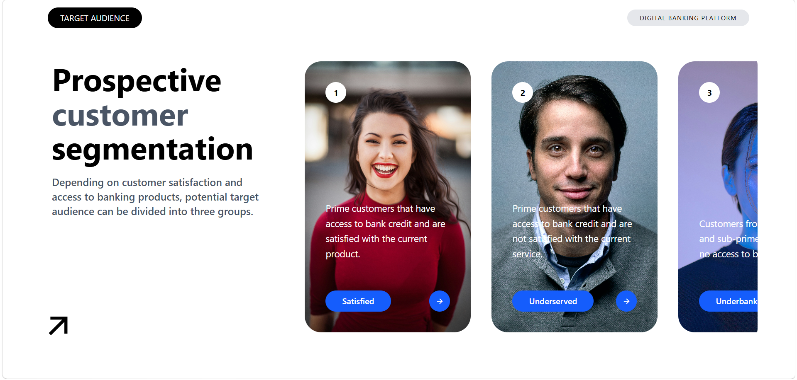

# 🎯 Prospective Customer Segmentation

A modern **Prospective Customer Segmentation** interface built with **React.js** and **Tailwind CSS**.

This project recreates a digital banking platform design that presents different customer segments through visually appealing profile cards. The project focuses on building a clean, reusable, and component-based UI using React.

## Project Preview

## Project Screenshot



## Features

* 🎨 Modern and clean UI design
* ⚛️ Built with React.js
* 🎯 Customer segmentation cards
* 🧩 Reusable React components
* 📦 Data-driven cards using arrays
* 🔄 Dynamic rendering with `.map()`
* 📋 Data passed using React props
* 🎨 Styled completely with Tailwind CSS
* 📱 Responsive layout
* 🖼️ Customer profile images
* 🏷️ Customer category tags
* ➡️ Interactive arrow elements

## 👥 Customer Segments

The interface represents three main customer segments:

### 1. Satisfied

Prime customers who have access to bank credit and are satisfied with the current product.

### 2. Underserved

Prime customers who have access to bank credit but are not satisfied with the current service.

### 3. Underbanked

Customers from near-prime and sub-prime segments who have no access to bank credit.

## 🛠️ Technologies Used

* **React.js**
* **JavaScript**
* **Tailwind CSS**
* **Vite**
* **HTML5**

## 📚 React Concepts Practiced

This project was built to practice fundamental React concepts, including:

* React components
* Reusable components
* Props
* Arrays of objects
* `.map()`
* Dynamic data rendering
* Component-based architecture

Example data structure:

```js
const users = [
  {
    img: "...",
    intro: "Customer description...",
    tag: "Satisfied",
  },
  {
    img: "...",
    intro: "Customer description...",
    tag: "Underserved",
  },
];
```

The data is then passed to a reusable card component using props.

## 🎨 Tailwind CSS Concepts Practiced

The project uses Tailwind CSS utilities for:

* Flexbox layouts
* `flex`
* `items-center`
* `justify-between`
* Spacing
* Padding and margins
* Width and height
* Rounded corners
* Positioning
* Typography
* Background images
* Responsive design
* Overlay content

For example:

```jsx
<div className="flex items-center justify-between">
```

`items-center` aligns items along the cross axis, while `justify-between` creates maximum space between items along the main axis.

## 📁 Project Structure

```text
project/
│
├── assets/
│   └── project.png
│
├── components/
│   ├── Card.jsx
│   ├── Header.jsx
│   └── Content.jsx
│
├── App.jsx
├── main.jsx
├── index.css
├── package.json
└── README.md
```

## ⚙️ Installation

Install the project dependencies:

```bash
npm install
```

## 🚀 Run the Project

Start the Vite development server:

```bash
npm run dev
```

Then open the local URL provided by Vite in your browser.

## 🎯 Project Objective

The purpose of this project is to practice creating a professional interface using **React.js and Tailwind CSS**.

Instead of creating each customer card manually, the project uses an array of objects and React's `.map()` method to dynamically generate reusable cards. This makes the application easier to maintain, extend, and reuse.

## 👨‍💻 Author

**Adil Hayat**

Built as a **React.js + Tailwind CSS learning project**.
